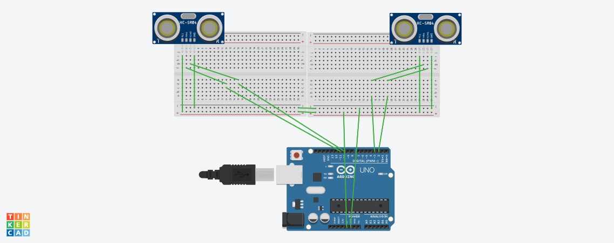
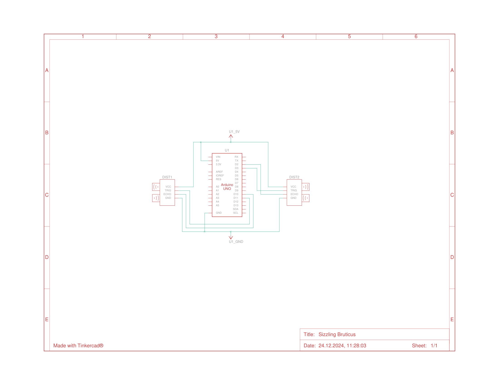

# Speed Detector Sensor Project

This project uses an Arduino and an 2 ultrasonic sensors to measure the speed of objects. Both sensors detect changes in the measured distance to see if a object passed by it. The first sensor starts a timer, the second one stops the timer and outputs the calculated speed.
This project was created as part of the Scientific Measurements class of Nagoya University.

## What you need

- Arduino Uno
- 2x Ultrasonic Sensor (HC-SR04)
- Breadboard
- Jumper wires

## Get started

1. Build your circuit similar to the Wiring Diagrams:

You can find a schematic diagram:
.

2. Measure the distance between two sensors by hand (in cm).
3. Write the distance in **distSensors** in the first line of the [code](/arduino/arduino.ino).
4. Note which pins are connected to which trigger/echo pin of the sensors
5. Adjust the pins and in lines 3-6 of the [code](/arduino/arduino.ino). **triggerP1** and **echoP1** belong to the sensor that starts the timer.

## Usage

1. Upload the sketch to your Arduino and observe the Serial Monitor.
2. Pass an object in front of both sensors and look at the speed.